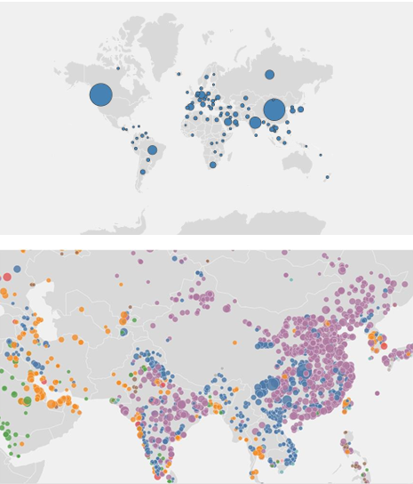
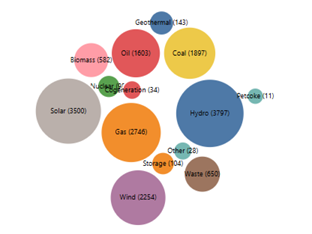
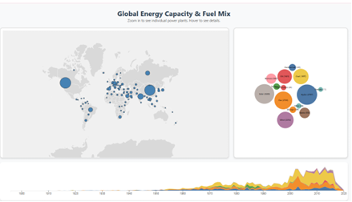
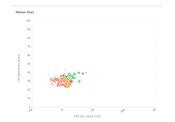
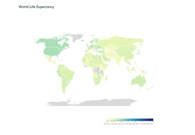
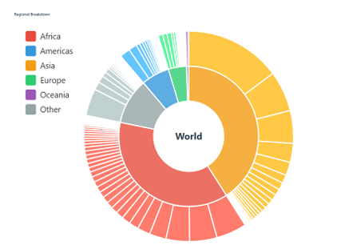
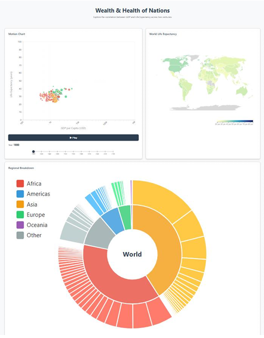

# Advanced Interactive Dashboards via D3.js (v7)
### Temporal, Spatial & Hierarchical Simulations

> **Author:** Ramalah Amir — Data Science, FAST-NUCES Islamabad  
> **Course:** Data Visualization & Analytics

---

## Overview

Two production-grade, fully interactive dashboards built in **pure D3.js (v7)** — no charting libraries, no abstractions. Every visualization is built from scratch using D3 primitives, with a focus on performance, linked views, and intuitive user interaction.

---

## Dashboard 1 — Global Energy Capacity & Fuel Mix

A spatial-temporal exploration tool for analyzing **35,000+ global power plants** across fuel types, geographies, and decades.

### Features

- **Semantic Zoom Map** — zooms out to aggregated country-level capacity bubbles; zooms in to individual power plant points colored by fuel type. Prevents overplotting while preserving granular detail.
- **Viewport Filtering** — renders only the ~500 points visible on screen at any time, achieving smooth **60fps** zooming and panning despite a 35,000-point dataset.
- **Force-Directed Bubble Chart** — shows energy source distribution; clicking a bubble filters the entire dashboard to that fuel type.
- **Brushable Stacked Area Timeline** — cumulative capacity by year; brush to select a time range and all linked views update simultaneously.
- **Centralized State Management** — a single `updateGlobalState()` function propagates filter changes across all views simultaneously.

### Screenshots

**Semantic Zoom — Country Bubbles (zoomed out) & Individual Plants (zoomed in)**


**Force-Directed Fuel Type Chart**


**Combined Dashboard 1 Output**


### Technical Highlights

| Challenge | Solution |
|---|---|
| 35,000 SVG elements → browser lag | Viewport filtering: only render visible points |
| Recalculating projections per frame | Pre-calculate `d.x`, `d.y` at initialization |
| GeoJSON vs CSV country name mismatch | Normalization layer to align "USA" / "United States of America" |
| Linked filtering across views | Centralized reactive state object |

---

## Dashboard 2 — Wealth & Health of Nations

An animated, multi-view exploration of the **correlation between GDP per capita and life expectancy** across two centuries and every country in the world.

### Features

- **Animated Motion Chart** — scatter plot that plays through years using `d3.interval`; bubbles transition smoothly with `d3.transition` and linear interpolation. Logarithmic X-axis for GDP, square root scale for population radius.
- **Synchronized Choropleth Map** — world map colored by life expectancy that updates in real-time with the animation via an `.update(year)` method.
- **Sunburst Drill-Down** — hierarchical chart (World → Continent → Country); hovering over a continent highlights corresponding bubbles in the motion chart.
- **Two-Way Slider** — dragging pauses animation and jumps to that year; playing the animation moves the slider handle automatically.

### Screenshots

**Animated Scatter Plot (Motion Chart)**


**Synchronized Choropleth Map**


**Sunburst Drill-Down Chart**


**Combined Dashboard 2 Output**


### Technical Highlights

| Design Decision | Rationale |
|---|---|
| Log scale for GDP | Linear scale compresses developing nations into an unreadable cluster |
| Square root scale for population radius | Direct mapping would make large countries appear exponentially bigger |
| Synchronized `.update(year)` across views | Ensures cohesive storytelling — all views always reflect the same moment in time |
| Sunburst as filter | Hundreds of bubbles are hard to parse; sunburst acts as a high-level drill-down control |

---

## Tech Stack

- **D3.js v7** — all visualizations built from scratch using D3 primitives
- **JavaScript (vanilla)** — no frameworks
- **GeoJSON** — world map rendering
- **HTML/CSS** — dashboard layout and styling

---

## Repository Structure

```
├── Task1/                  # Global Power Plants dashboard
│   ├── main.js             # Centralized state management
│   ├── map.js              # Semantic zoom map
│   ├── fuelChart.js        # Force-directed bubble chart
│   └── timeline.js         # Brushable stacked area chart
├── Task2/                  # Wealth & Health of Nations dashboard
│   ├── motionChart.js      # Animated scatter plot
│   ├── choropleth.js       # Synchronized world map
│   ├── sunburst.js         # Hierarchical drill-down
│   └── slider.js           # Two-way animation control
└── README.md
```

---

## Key Concepts Demonstrated

`Semantic Zoom` `Viewport Culling` `Linked Views` `Force Simulation` `Brushing & Filtering` `Choropleth Mapping` `Sunburst / Partition Layout` `Animation & Transitions` `Centralized State Management` `Performance Optimization`
